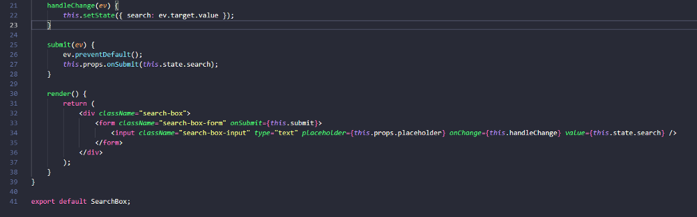
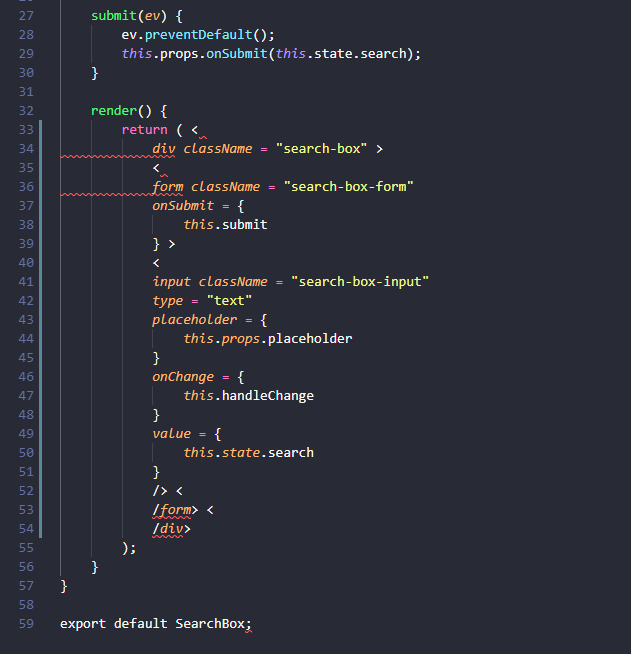
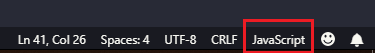
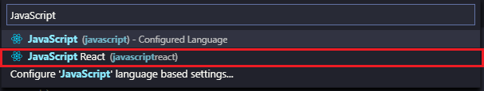
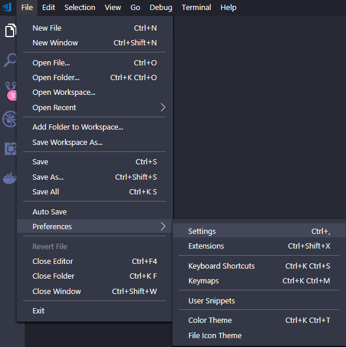
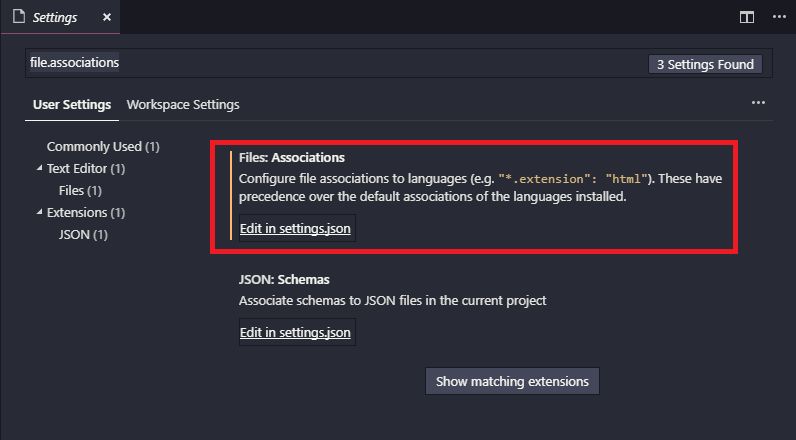
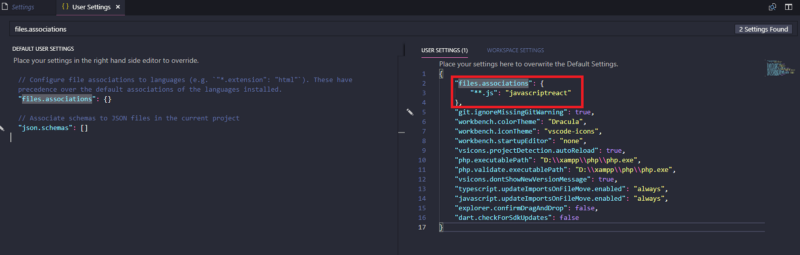

Are you annoyed with Visual Studio Code’s formatter when working with JSX?

It happened to me earlier. I have the habit to format the code after coding to make the code more readable and beautiful. The VSCode formatter works well on many language, until I worked with JSX in JavaScript file…

It can turned the code like this…



transformed to this ugly guy…



## Simple Solution

Most simple solution is just click on Language Mode on the bottom right of Visual Studio Code and change from **JavaScript** to **JavaScript React** instead.





Now you can work without worry that formatter will breaks your JSX.

*But wait … Do I need to do these steps on every *.js file?*

No! Actually, you can tell Visual Studio Code to use **JavaScript React** language mode on every JavaScript file by default.

Configure Visual Studio Code Supports JavaScript React by Default

Go to user settings.
 In Windows and Linux go to menu **File > Preferences > Settings**
 In MacOS go to **Code > Preferences > Settings**



Search for files.associations, the files associations setting will be shown as the first result, click on Edit in settings.json



In the left panel it will be default user settings, which is usually empty, and in the right panel will contains user settings that will overrides the system settings. Your settings should be like example below.



Your exists settings might be different, but we just add a new files.associations settings to let all JavaScript files support **“javascriptreact”** language mode by default. So you just adding these property and value:

```javaScript
<script>
let x = 2;
{
     "files.associations": { "**.js": "javascriptreact" },
     …
}
</script>
```

This make our life easier! I hope this guide will be helpful to you guys. Happy coding!